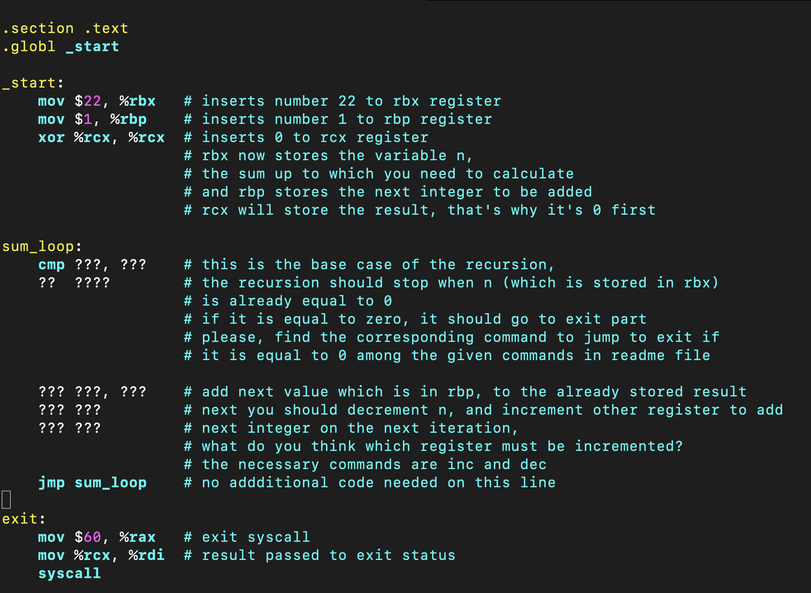

# sum lab

Hello everyone

Today, we are going to write an assembly code which will alculate the sum of integers from 1 to n.
Some part of the code is given in the screenshot below.
The other part you should fill in yourself (wherever you see ? marks).

0) First things first: when you have successfully cloned your repo with ssh key, cd to your repo, create an assembly file named math.s (it's important to name it exactly math.s not anything else, if you don't want to edit the makefile (:  )
1) Next, type all the parts that are already  written in my sample asm file in the screenshot.

2) Now, follow the instructions in the comments to fill in the missing part

3) cmp is a command for comparing.
As for the part where you need to exit when n is already 0:
we have these commands:
jl, jle, jg, jge, je, jz
Please, find out yourself which one of them you need to use and how.

4) if n is not zero yet, the code should continue normally to calculate until n IS zero.

5) After you followed all instructions and are done with the coding part, save and exit vim, type make in the terminal to compile and link the program, and then make test to check whether your code has given the expected output.
If the terminal smiles saying success, you did everything correct, great.
If the terminal is sad and says failure, then try to find your mistake.

6) After you successfully completed coding, you should add, commit push.
IMPORTANT: Please add only the assembly file that you have written, not the entire directory
So do git add math.s
then git commit and push like you did in the previous 2 labs.

If you are done, you did a great job!

